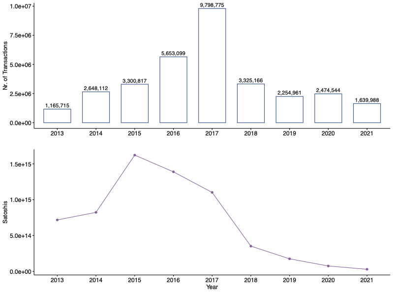
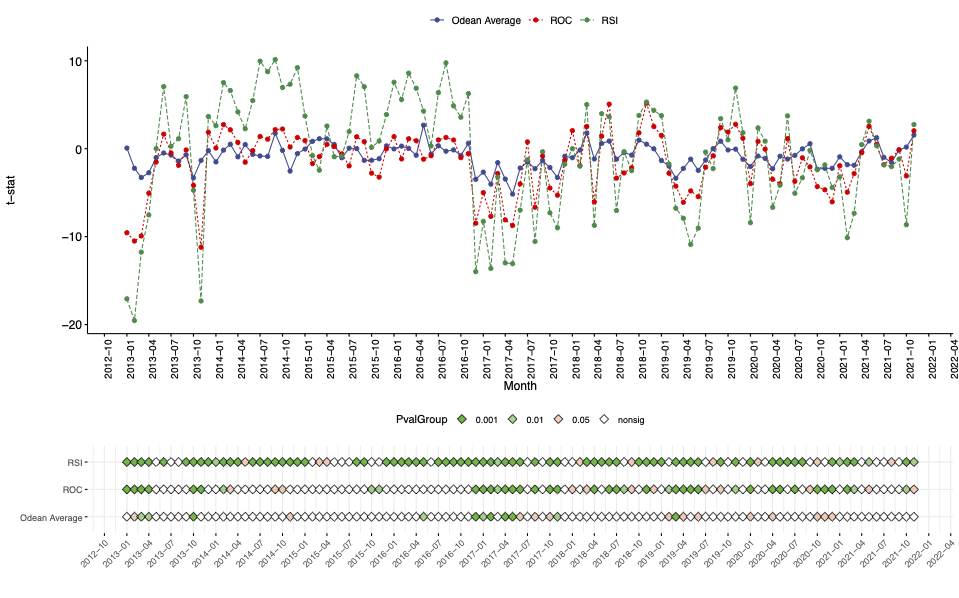
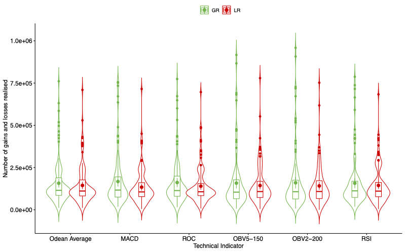

# CryptoDisposition - Disposition Effect in Cryptocurrencies

This repository contains the necessary data files and scripts to test the [disposition effect](https://en.wikipedia.org/wiki/Disposition_effect) in cryptocurrencies (like Bitcoin). The methodology is based on and inspired by the approach of proportion of losses realised (PLR) and proportion of gains realised (PGR) introduced by [Terence Odean](https://onlinelibrary.wiley.com/doi/10.1111/0022-1082.00072). It builds upon hourly OHLC data from Kaiko (values averaged over multiple exchanges) and the transaction data provided by the [GraphSense](https://github.com/graphsense) platform of the [Austrian Institute of Technology](https://www.ait.ac.at/).

The script compares losses realised (LR) versus gains realised (GR) for selected Technical Market Indicators to identify if investors act differently in upwards or downwards trending markets. Finally, LR and GR are compared via t-test.

The process is structured into the following steps - we recommend and used Visual Studio Code IDE with Python 3.7.8 and the related VS Code Python plugin for linting and debugging support:

## Step 1 - OHLC data preparation

_You can skip this step as the aggregated data is stored in this [file](https://github.com/jschatzmann/CryptoDisposition/blob/master/data/_ex/all_btcusd_ohlcv_1h_ex.csv) - the steps are described for the reason of completeness._

[Kaiko OHLC merge script](https://github.com/jschatzmann/CryptoDisposition/blob/master/code/Kaiko_OHLC_merge_exch-files.py)

```python
python3 Kaiko_OHLC_merge_exch-files.py
```

1) the raw OHLC files are stored in '../data/kaiko-ohlcv-1h-year'
2) a folder '../data/kaiko-ohlcv-1h-year/_ex' will be created
3) the folder contains the working temporary files as well as the result file **all_btcusd_ohlcv_1h_ex.csv** that contains the averaged values over all exchanges

## Step 2 - join OHLC data and transactions, compute technical indicators and conduct t-test

The transaction data file 'txs_to_exchanges.csv' is not available on Github due to file size constraints, please contact me in case of re-runs.

[Cryto Disposition](https://github.com/jschatzmann/CryptoDisposition/blob/master/code/CryptoDisposition.py)

1) the '../data/' folder needs to contain the transaction file **'txs_to_exchanges.csv'** (-> reach out due to file size constraints)
2) the '../data/kaiko-ohlcv-1h-year/_ex/' folder needs to contain the OHLC exchange file **'all_btcusd_ohlcv_1h_ex.csv'** from the previous step
3) run all cells / script

```python
python3 CryptoDisposition.py
```

This script will produce three result files:

Summary of all t-statistics for all indicators (main file)

> **../results/df_tstat_results_YYYY-MM-DD_HH_MM_SS.xlsx**

Export of the detailed calculation for offline / further analysis

>**../data/_dfTA_export_YYYY-MM-DD_HH_MM_SS.csv**

Export of daily statistics data for plots used in the paper publicaion

> **../results/_dfPaperPlotsperMonth_export_YYYY-MM-DD_HH_MM_SS.xlsx**

## Results

An aggregated, yearly view of cummulated sell transaction counts (TxCount) and the corresponding transferred BTC amount (TxValue).


This is a longitudinal chart providing a combined view of the amount of BTC sell transactions (bottom barchart), the value of the BTC sell transactions, and the related BTC price.


This a graphical representation of three selected example technical indicators and their related t-statistics over time (top) as well as their significance level (heatmap bottom - only for relevant minus t-values).


This plot represents a comparison of the GR and LR values for disposition effect confirming indicators. You see the mean dashed green line for GR is visually above the LR (red) dashed line, signalling disposition effect driven traing.



## Further Information

The script is using the defined LR and GR columns that store the counts of the sell transactions of specified technical indicators following the related classification rules to conduct a t-test. Like for example in case of SMA:

```python
colGR = 'ti_sma1-50_GR'
colLR = 'ti_sma1-50_LR'
```

Results are saved in the df\*Overall, df\*PerYear, and df\*PerMonth dataframes, for SMA e.g.

```python
dfSmaOverall = tstat_for_df_colums(df_per_timeframe(dfTa, dt_start, dt_end), colLR, colGR) # tstat overall timeframe
dfSmaPerYear = tstat_for_indicator(dfTa, colLR, colGR, 12) # tstat values per year
dfSmaPerMonth = tstat_for_indicator(dfTa, colLR, colGR, 1) # tstat values per month
```

### Trading window / technical indicator configuration

It is important to mention that the technical indicators usually are based on daily data. Due to the fact that we have hourly data available which is relevant as in case of Bitcoin a high volatility is evident, the indicator ranges can be adjusted by adding / removing the x24 (hours) multiplicator when calculating the indicators. In case standard daily aggregated calculation is required, re-run the script with a parameter "daily" as follows:

```python
python3 CryptoDisposition.py daily
```
